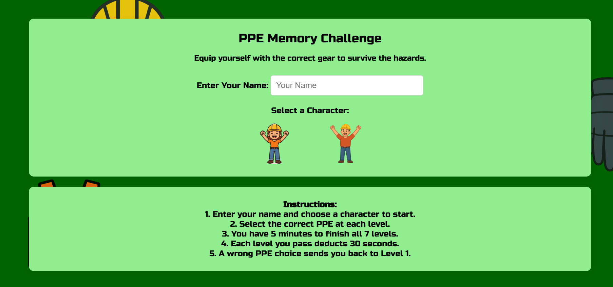

# 🦺 PPE Memory Challenge



## Game Description

**PPE Memory Challenge** is an interactive browser-based game that tests your knowledge of proper Personal Protective Equipment (PPE) for different hazardous environments.  
Select the correct gear for each job site to survive hazards and earn your certificate of safety!

This project was inspired by the importance of workplace safety and the need for engaging training tools in education and industry.

---

## Getting Started

**Play here:** [Live Deployed Game](https://ppememorygame.surge.sh/)

**Instructions:**
1. Enter your name and choose your character.
2. For each level, select all the correct PPE items needed for that environment.
3. Press **Enter Site** to check your answers.
4. Pass all levels within 5 minutes to win your certificate!
5. Use the **Hint** button (once per level) if you get stuck.
6. If you choose incorrectly, you’ll restart from Level 1.

**Planning Materials:**  
- [Game Flow & Wireframes](https://drive.google.com/file/d/1rHiL2kH0K_1GLFwiHw1z5OHZAxro_C-1/view?usp=sharing) 

**Pseudo Code**

```plaintext
ON GAME START:
    - Get player name and character choice
    - Show the level screen, hide home/instructions
    - Reset timer and level

FOR EACH LEVEL:
    - Show level background and title
    - Load list of PPE options
    - Wait for player to select PPE and press "Enter Site"

WHEN "ENTER SITE" PRESSED:
    - Compare selected PPE with required PPE for that level
    - IF correct:
        - Move to next level and reduce timer by 30s
        - IF last level, show certificate screen
    - ELSE:
        - Show hazard screen, play sound, and restart at Level 1

WHEN "HINT" BUTTON PRESSED:
    - IF hint not used yet this level:
        - Highlight (glow) one correct but unselected PPE item for this level
        - Disable hint button until next level

ON TIMER REACHES ZERO:
    - Show timeout screen and offer restart

ON "PRINT CERTIFICATE":
    - Show certificate print view (only certificate visible on print)

ON "RESTART":
    - Reset timer and current level to 1
    - Return to home screen
```
---

## Attributions

- PPE SVG icons by [Freepik](https://www.freepik.com/) and [Flaticon](https://www.flaticon.com/)
- Sounds from [Zapsplat](https://www.zapsplat.com/)
- Google Fonts: [Poller One](https://fonts.google.com/specimen/Poller+One), [Russo One](https://fonts.google.com/specimen/Russo+One)
- [Sora.com](https://sora.chatgpt.com/) for background images and all other contents

---

## Technologies Used

- HTML
- CSS
- JavaScript 
- [Google Fonts](https://fonts.google.com/)
- [Sora](https://fonts.google.com)

---

## Next Steps

- Add accessibility improvements (WCAG 2.0 AA)
- Mobile UX optimizations
- Sound/music toggle and volume controls
- Scoreboard / leaderboard feature
- More environments and PPE types
- User statistics and certificate download as PDF

---

